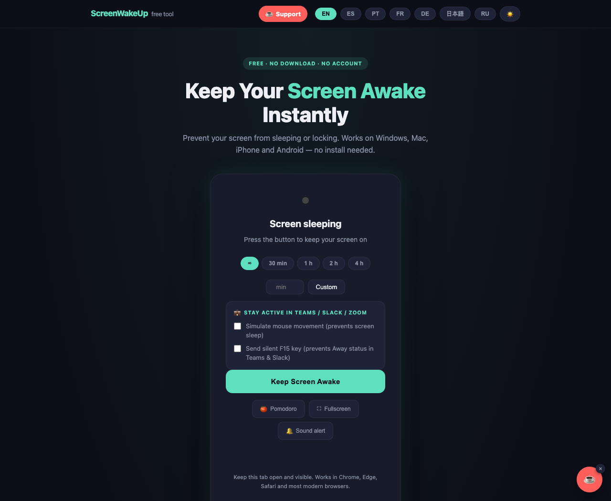

# ScreenWakeUp

**https://screenwakeup.com** — a free web page that keeps your screen awake. One click, no download, no account, no ads.

It does one honest thing: it asks the browser for a [Screen Wake Lock](https://developer.mozilla.org/en-US/docs/Web/API/Screen_Wake_Lock_API) so your screen doesn't dim, sleep or lock while the tab stays visible. It does **not** simulate mouse or keyboard input — browsers can't, and the site says so. Sites that promise otherwise are selling the same wake lock with a false label.

## What it does

- Keeps the screen on with the native Wake Lock API, with a silent-video fallback for browsers without it.
- Presets (30 min, 1 h, 2 h, 4 h, unlimited) or any number of minutes.
- Pomodoro timer, fullscreen clock, floating mini-window (Picture-in-Picture) for when you work in other apps.
- Dark and light mode, 7 languages (EN, ES, PT, FR, DE, JA, RU).
- Honest limits, stated in the FAQ: the lock is released when the tab is hidden or the OS enforces battery saving.

## Guides

- [Prevent the Away status in Microsoft Teams](https://screenwakeup.com/prevent-teams-away/)
- [Free Caffeine alternative for Mac and Windows](https://screenwakeup.com/caffeine-alternative/)
- [Keep the iPhone screen awake without touching Auto-Lock](https://screenwakeup.com/keep-screen-awake-iphone/)
- [Keep Zoom active](https://screenwakeup.com/prevent-zoom-idle/)

## Repository layout

Static HTML, no build step for the app itself. `index.html` is the English app; `<lang>/index.html` are the hand-maintained translations; `scripts/generate_landing_pages.py` renders the translated guides from `scripts/landing_content.py` and rebuilds `sitemap.xml`. Hosted on Cloudflare Pages.

## Support

If it saved your screen, you can [leave a tip](https://ko-fi.com/screenwakeup). It is built and paid for by one person and will stay free.
